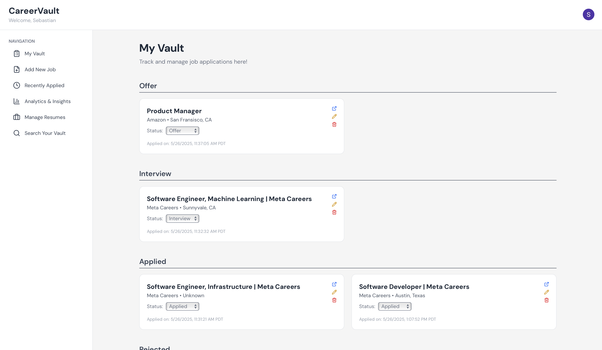
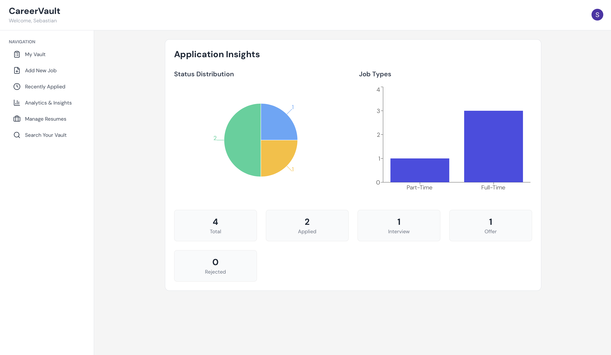
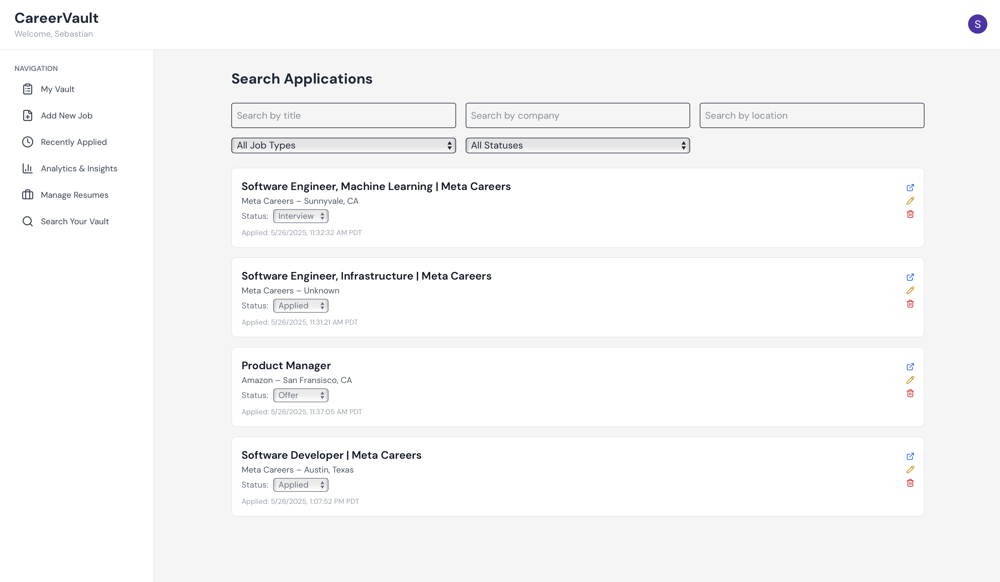

# career-vault

CareerVault is a full-stack job application management platform developed to help users efficiently track and analyze their job search activities. It offers features such as resume management, job tracking, job application search, analytics, and AI job description summarization. The application is built using a Next.js frontend and a Flask backend, deployed in a containerized architecture on AWS.

---

## Features

* Google user authentication
* Job application tracking by status (Applied, Interview, Offer, Rejected)
* Resume upload, storage, and management with secure access
* Analytics dashboard for insights into job application trends
* AI job description summarization

---

## Technologies Used

### Frontend

* Next.js (Pages Router)
* TailwindCSS
* NextAuth.js (Google OAuth)
* TypeScript
* Axios

### Backend

* Flask (Python)
* SQLAlchemy ORM
* PostgreSQL (via SQLAlchemy)
* Boto3 for AWS S3 integration
* Hugging Face Transformers API for job description summarization

### Infrastructure and Deployment

* **AWS EC2**: The frontend and backend services are deployed in separate Docker containers on EC2 instances.
* **AWS S3**: Used for storing user-uploaded resumes securely and efficiently.
* **AWS RDS (PostgreSQL)**: Hosts the application's relational database.
* **Hugging Face Inference API**: Provides natural language summarization of job descriptions using the `distilbart-cnn-12-6` model. The integration is secured via an API token, as shown below:

  ```python
  API_URL = "https://api-inference.huggingface.co/models/sshleifer/distilbart-cnn-12-6"
  HF_TOKEN = os.environ.get("API_TOKEN")
  HEADERS = {"Authorization": f"Bearer {HF_TOKEN}"}
  ```

---

## Application Pages

* `/login`: Login page with Google OAuth
* `/`: Main dashboard with grouped job applications
* `/add`: Add a new job application
* `/applications/edit/[id]`: Edit an existing application
* `/account`: View user profile and logout
* `/resumes`: Upload and manage resumes
* `/insights`: Visual insights and application metrics
* `/search`: Allows users to search their job applications based on name, company, stauts, etc.

---

## Database Models

### User

* `id`: UUID
* `email`: Email address
* `name`: Display name
* `profile_pic`: Profile image URL
* `created_at`: Account creation timestamp

### Resume

* `id`: UUID
* `user_id`: Foreign key to user
* `filename`: Original filename
* `file_url`: Public or signed access URL
* `s3_key`: AWS S3 key
* `uploaded_at`: Upload timestamp

### JobApplication

* `id`: UUID
* `user_id`: Foreign key to user
* `company_name`: Company name
* `title`: Job title
* `job_type`: Type of position (Full-time, Part-time, etc.)
* `location`: Job location
* `application_url`: URL to the job posting
* `status`: Application status
* `applied_at`: Timestamp of application
* `updated_at`: Last updated timestamp
* `description`: Job description (optional)
* `resume_used`: Foreign key to resume (nullable)
* `application_method`: How the application was submitted

---

## Setup Instructions

### 1. Clone the repository

```bash
git clone https://github.com/yourusername/career-vault.git
cd career-vault
```

### 2. Set up environment variables

Create `.env` files for both the frontend and backend environments.

#### Frontend (.env.local)

```
GOOGLE_CLIENT_ID=your_google_client_id
GOOGLE_CLIENT_SECRET=your_google_client_secret
NEXTAUTH_SECRET=nextauth_secret
NEXTAUTH_URL=http://localhost:3000
DATABASE_URL=database_url
NEXT_PUBLIC_API_BASE_URL=http://localhost:5000
```

#### Backend (.env)

```
GOOGLE_CLIENT_ID=your_google_client_id
FLASK_SECRET_KEY=your_flask_secret_key
DATABASE_URL=database_url
API_TOKEN=api_token
AWS_ACCESS_KEY_ID=aws_access_key_id
AWS_SECRET_ACCESS_KEY=aws_secret_access_key
AWS_S3_BUCKET=aws_s3_bucket

```

### 3. Run with Docker (optional)

```bash
docker-compose up --build -d
```

Or, you can also run the frontend and backend independently with `npm run dev` and `flask run`.

---

## Future Enhancements

* Full-text search across job applications
* Notification and follow-up reminders
* Admin interface for user and data management
* Improved PDF parsing capabilities
* Email or in-app alerts for application status changes

---

## 📸 Screenshots

### Dashboard View


### Analytics Page


### Search Page


